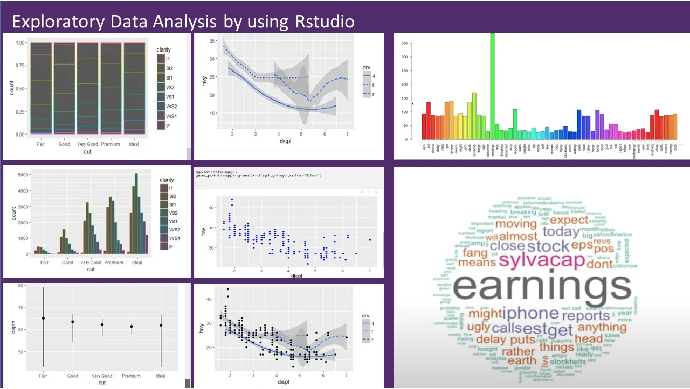

```{r setup, include=FALSE}
knitr::opts_chunk$set(echo = TRUE, fig.align="center")
img_path <- "img/"
```

```{r, echo=FALSE}
screenshots <- list.files(file.path("img/", "windows-screenshots"))
screenshots <- file.path("img/", "windows-screenshots", screenshots)
mac_screenshots <- list.files(file.path("img/", "mac-screenshots"))
mac_screenshots <- file.path("img/","mac-screenshots", mac_screenshots)
```

## Why R?

R is not a programming language for software development like C or Java. It was created by statisticians as an environment for data analysis. A history of R is summarized here: [A Brief History of S](http://lcolladotor.github.io/courses/Courses/R/resources/history_of_S.pdf). 

{height=50%}

The __interactivity__ of R (more later), is an indispensable feature in data science because, as you will learn, the ability to quickly explore data is a necessity for success in this field. 

## Why R?
{height=80%}

However, like in other programming languages, you can save your work as scripts that can be easily executed at any moment. These scripts serve as a record of the analysis you performed, a key feature that facilitates reproducible work. 

## Why R?
R does not follow conventions of more "traditional" programming languages. However, you will come to appreciate the unequal power of R when it comes to data analysis and data visualization.

{height=65%}


## Why R?
Other attractive features of R are:

1. R is [free and open source](https://opensource.org/history).
2. It runs on all major platforms: Windows, Mac Os, UNIX/Linux.
3. Scripts and data objects can be shared seamlessly across platforms.
4. There is a large, growing, and active community of R users and, as a result, there are numerous resources for learning and asking questions^[https://www.r-project.org/help.html] ^[https://stackoverflow.com/documentation/r/topics] ^[https://stats.stackexchange.com/questions/138/free-resources-for-learning-r]. 
5. It is easy for others to contribute add-ons which enables developers to share software implementations of new data science methodologies.

## The R console

Interactive data analysis usually occurs on the _R console_ that executes commands as you type them. It looks like this:

\center


## The R console


As a quick example, try using the console to calculate a 15% tip on a meal that cost $19.71:

```{r, tip_calculator}
0.15 * 19.71  
```

**Pro Tip:** Grey boxes are used to show R code typed into the R console. The symbol `##` is used to denote what the R console outputs.


## Scripts

One of the great advantages of R over point-and-click analysis software is that you can save your work as scripts. You can edit and save these scripts using a text editor. We will use the interactive _Integrated Development Environment_ (IDE) [RStudio](https://www.rstudio.com/). 


## RStudio {#rstudio}

RStudio will be our launching pad for data science projects. It provides an editor for our scripts and provides many other useful tools. We go over some of the basics.

{height=40%}

## RStudio Panes

When you start RStudio for the first time, you will see three panes. The left pane shows the R console, the right top pane includes tabs for the _Environment_ and _History_, while the bottom right shows five tabs: _File_, _Plots_, _Packages_, _Help_, and _Viewer_. 

```{r, echo=FALSE, out.width = "100%",  out.extra=""}
knitr::include_graphics(screenshots[30]) 
```

## RStudio Scripts
For a new script, you can click on File, then New File, then R Script. 

```{r, echo=FALSE, out.width = "100%",  out.extra=""}
knitr::include_graphics(screenshots[31]) 
```

## RStudio Scripts
This starts a new pane on the left and it is here where you can start writing your script. 

```{r, echo=FALSE, out.width = "100%",  out.extra=""}
knitr::include_graphics(screenshots[32]) 
```

## Running commands while editing scripts

RStudio is an _Integrated Development Environment_ (IDE) specifically made for R coding. One of the main advantages provided by RStudio over other editors is that we can test our code easily as we edit our scripts. Here we show an example.

## Running commands while editing scripts
Let's start by opening a new script and giving the script a name. We can do this through the editor by saving the current new unnamed script.  

```{r, echo=FALSE, out.width = "100%",  out.extra=""}
knitr::include_graphics(screenshots[39]) 
```

## Running commands while editing scripts
When saving a script, a good convention is to use a descriptive name, with lower case letters, no spaces, only hyphens to separate words, and then followed by the suffix _.R_. We will call this script _my-first-script.R_.

```{r, echo=FALSE, out.width = "100%",  out.extra=""}
knitr::include_graphics(screenshots[40]) 
```

## Running commands while editing scripts
Now we are ready to start editing our first script. The first lines of code in an R script are dedicated to loading the libraries we will use. 

Another useful RStudio feature is that once we type `library()` it starts auto-completing: note what happens when we type `library(ti)`:

```{r, echo=FALSE, out.width = "100%",  out.extra=""}
knitr::include_graphics(screenshots[41]) 
```

## Running commands while editing scripts
You may have noticed is that when you type `library(` the second parenthesis is automatically added. This will help you avoid one of the most common errors in coding: forgetting to close a parenthesis.

## Running commands while editing scripts
Now as an example, we will make a graph showing murder totals versus population totals by state. Try it out by _executing_ the code. To do this, click on the `Run` button on the upper right side of the editing pane. You can also use the key binding: `Ctrl+Shift+Enter` on Windows or `command+shift+return` on the Mac.

```{r, echo=FALSE, out.width = "100%",  out.extra=""}
knitr::include_graphics(screenshots[42]) 
```

## Running commands while editing scripts
You will see your code appear in the R console and, in this case, the generated plot appears. The plot console has a useful interface that permits you to click back and forward across different plots, zoom in to the plot, or save the plot as a file.

```{r, echo=FALSE, out.width = "100%",  out.extra=""}
knitr::include_graphics(screenshots[43]) 
```

## Changing global options
You can change the look and functionality of RStudio quite a bit. 

To change global options you click on _Tools_ then _Global Options_: 
```{r, echo=FALSE, out.width = "100%",  out.extra=""}
knitr::include_graphics(screenshots[44]) 
```

## Changing global options
As an example, click on _Appearance_ and then notice the _Editor theme_ options.

```{r, echo=FALSE, out.width = "100%",  out.extra=""}
knitr::include_graphics(screenshots[45]) 
```

## Changing global options
You can click on these and see examples of how your editor will look. 

```{r, echo=FALSE, out.width = "100%",  out.extra=""}
knitr::include_graphics(screenshots[46]) 
```

## Changing global options
I personally like the _Cobalt_ option:

```{r, echo=FALSE, out.width = "100%",  out.extra=""}
knitr::include_graphics(screenshots[47]) 
```

## Changing global options
As a second example, we show how to make a change that we **highly recommend**. This is to change the _Save workspace to .RData on exit_ to _Never_ and uncheck the _Restore .RData into workspace at start_. By default, when you exit R saves all the objects you have created into a file called .RData. To change these options, make your _General_ settings look like this:

```{r, echo=FALSE, out.width = "100%",  out.extra=""}
knitr::include_graphics(screenshots[48]) 
```


## Installing R packages

The functionality provided by a fresh install of R is only a small fraction of what is possible. In fact, we refer to what you get after your first install as __base R__. The extra functionality comes from add-ons available from developers. 

There are currently hundreds of these available from CRAN and many others shared via other repositories such as GitHub. However, because not everybody needs all available functionality, R instead makes different components available via __packages__. 

## Installing R packages
R makes it very easy to install packages from within R. For example, to install the __dslabs__ package, which we use to share datasets and code related to this book, you would type:

```{r,eval=FALSE}
install.packages("dslabs")
```

We can install more than one package at once by feeding a character vector to this function:

```{r, eval=FALSE, echo=TRUE}
install.packages(c("tidyverse", "dslabs"))
```

## Installing R packages (Windows)
If you are using Windows, you may get a warning that says:

`WARNING: Rtools is required to build R packages but is not currently installed.` 

**Rtools** is a toolchain bundle used for building R packages from source (those that need compilation of C/C++ or Fortran code) and to build R itself from source. We won't cover this here, but for a detailed step-by-step instruction tutorial can be found by clicking the following link: 

\center \footnotesize
[https://jtleek.com/modules/01_DataScientistToolbox/02_10_rtools/](https://jtleek.com/modules/01_DataScientistToolbox/02_10_rtools/)


## Installing R packages
In RStudio, you can navigate to the __Tools__ tab and select install packages in the following way: 

```{r, echo=FALSE, out.width = "100%",  out.extra=""}
knitr::include_graphics(screenshots[35]) 
```


## Installing R packages
RStudio will auto-complete package names, which is helpful when you do not remember the exact spelling of the package:

```{r, echo=FALSE, out.width = "100%",  out.extra=""}
knitr::include_graphics(screenshots[36]) 
```

## Installing R packages
Remember packages are installed in R not RStudio.

Also note that installing __tidyverse__ actually installs several packages. This commonly occurs when a package has **dependencies**, or uses functions from other packages. When you load a package using `library`, you also load its dependencies.

## Installing R packages
Once packages are installed, you can load them into R using the `library` function: 
```{r}
library(dslabs)
```

As you go through this tutorial, you will see that we load packages without installing them. This is because once you install a package, it remains installed and only needs to be loaded with `library`. The package remains loaded until we quit the R session. If you try to load a package and get an error, it probably means you need to install it first. 

## Installing R packages
**Pro Tip:** It is helpful to keep a list of all the packages you need for your work in a script because if you need to perform a fresh install of R, you can re-install all your packages by simply running a script.

You can see all the packages you have installed using the following function:

```{r, eval=FALSE, echo=TRUE}
installed.packages()
```


## Session Info
The `sessionInfo()` function reports information about your R session, including the OS and loaded packages. Its always good to end your analyses and reports with this function for reproducibility. 
\tiny
```{r session}
sessionInfo()
```
