```{r, include=FALSE}
if(knitr::is_html_output()){
  knitr::opts_chunk$set(out.width = "500px", 
                        out.extra='style="display: block; margin-left: auto; margin-right: auto; background-color: #000; padding:3px;"')
} else{
  knitr::opts_chunk$set(out.width = "4in")
}
```

```{r, echo=FALSE}
screenshots <- list.files(file.path("img/", "windows-screenshots"))
screenshots <- file.path("img/", "windows-screenshots", screenshots)
mac_screenshots <- list.files(file.path("img/", "mac-screenshots"))
mac_screenshots <- file.path("img/","mac-screenshots", mac_screenshots)
```

## Installing R and RStudio

**R** is a language for statistical computing and graphics. **RStudio** is an interactive desktop environment (IDE), but it is not R, nor does it include R when you download and install it. Therefore, to use RStudio, we first need to install R.

\center
{height=50%}

## Installing R (Windows and Mac)

Download R from the Comprehensive R Archive Network (CRAN): [https://cran.r-project.org/](https://cran.r-project.org/). Search for "CRAN" on your browser:

```{r, echo=FALSE}
knitr::include_graphics(screenshots[1])
```

## Installing (Windows and Mac) 

Once on the CRAN page, select the version for your operating system: Linux, Mac OS X, or Windows. Here we show screenshots for Windows, but the process is similar for the other platforms. When they differ, we will also show screenshots for Mac OS X.

```{r, echo=FALSE}
knitr::include_graphics(screenshots[2])
```


## Installing R (Windows)

Once at the CRAN download page, you will have several choices. You want to install the _base_ subdirectory. This installs the basic packages you need to get started. We will later learn how to install other needed packages from within R.

```{r, echo=FALSE}
knitr::include_graphics(screenshots[3])
```

## Installing R (Windows)
Click on the link for the latest version to start the download.

```{r, echo=FALSE}
knitr::include_graphics(screenshots[4])
```

## Installing R (Windows)
Once the installer file downloads, you can click on that tab to start the installation process. Some browsers may display this differently, so you will have to find where they store downloaded files and click on them to get the process started.

```{r, echo=FALSE}
knitr::include_graphics(screenshots[5])
```

## Installing R (Mac)
If using Safari on a Mac, things may look a little different
```{r, echo=FALSE}
knitr::include_graphics(mac_screenshots[13])
```


## Installing R (Mac)
If using Safari on a Mac, you can access the download through the download button.
```{r, echo=FALSE}
knitr::include_graphics(mac_screenshots[14])
```

## Installing R (Windows)
You can now click through different choices to finish the installation. We recommend you select all the default choices.

```{r, echo=FALSE}
knitr::include_graphics(screenshots[6])
```

## Installing R (Windows)
Select the default even when you get an ominous warning.

```{r, echo=FALSE}
knitr::include_graphics(screenshots[7])
```

## Installing R (Windows)
When selecting the language, consider that it will be easier to follow this tutorial if you select English.

```{r, echo=FALSE}
knitr::include_graphics(screenshots[8]) 
```

## Installing R (Windows)
Continue to select all the defaults:

```{r, echo=FALSE, out.width = "45%",  out.extra=""}
knitr::include_graphics(screenshots[9:12])
```

## Installing R (Windows)
```{r, echo=FALSE, out.width = "45%",  out.extra=""}
knitr::include_graphics(screenshots[13:15])
```

## Installing R (Mac)
On the Mac it looks different, but you are also accepting the defaults:

```{r, echo=FALSE, out.width = "45%",  out.extra=""}
knitr::include_graphics(mac_screenshots[15:18])
```

## Installing R (Mac)
```{r, echo=FALSE, out.width = "45%",  out.extra=""}
knitr::include_graphics(mac_screenshots[19:22])
```
    
## Installing R (Mac)
Congratulations! You have installed R. 
```{r, echo=FALSE}
knitr::include_graphics(mac_screenshots[23])
```


## Installing RStudio (Windows and Mac)

To install RStudio, start by searching for "RStudio" on your browser:

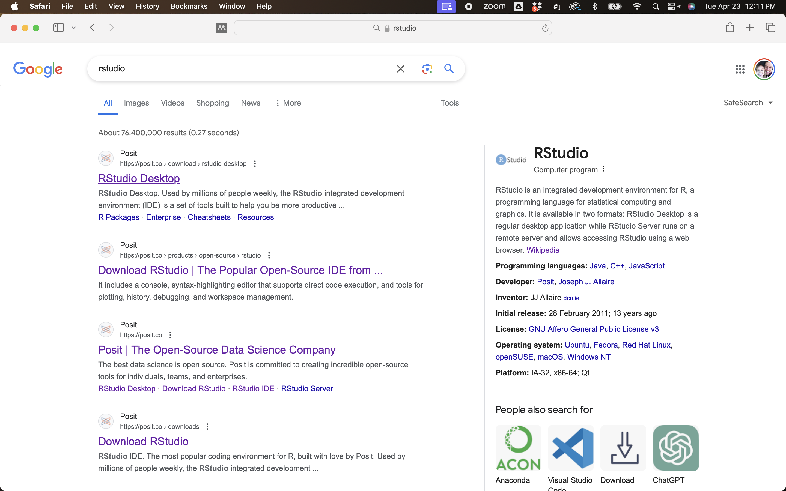

## Installing RStudio (Mac)
You should find the Posit/RStudio website as shown above. Once there, click on "Download RStudio Desktop for Mac OS 12+" below the _2: Install RStudio_ header. We first focus on Mac installation. 

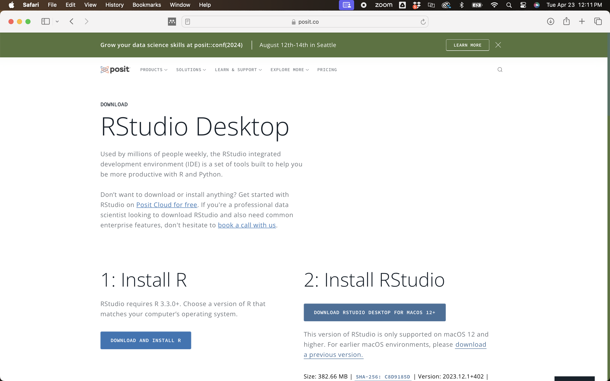


## Installing RStudio (Mac)
The download process should start. For Safari on Mac, you should see the progress in the bar at the top right. Double click on the download when its complete.  
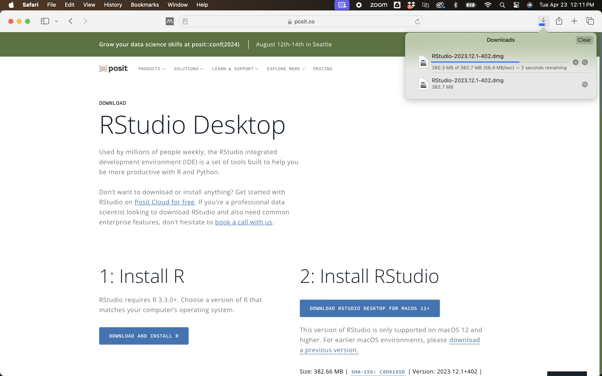

## Installing RStudio (Mac)
Now drag and drop the RStudio icon over the Applications icon:

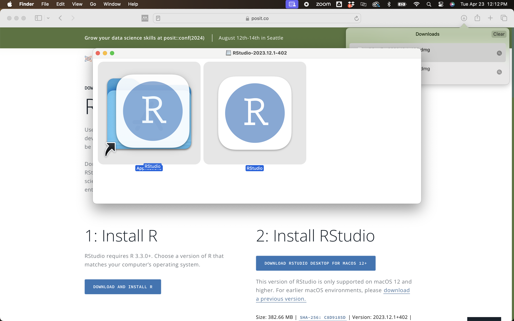

## Installing RStudio (Mac)
If you have a previous version of RStudio installed, it may ask if you want to overwrite the old version. We usually want to replace the old with the new, so click "Replace".
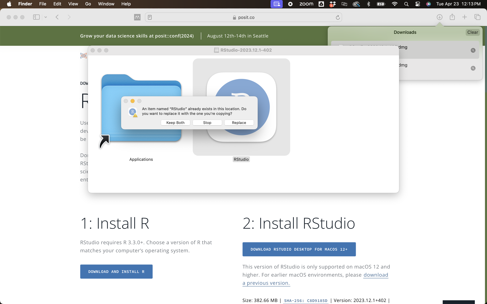

## Installing RStudio (Mac)
The system should copy RStudio to the Applications folder: 
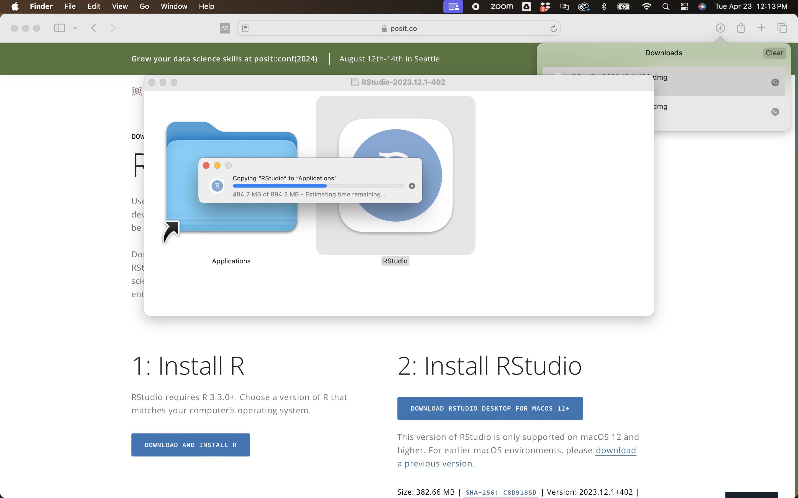

## Running RStudio (Mac)
Congratulations! You have installed RStudio. On the Mac, it will be in the Applications folder. Or you can click on the _Spotlight Search_ (magnifying glass in top right corner) and type rstudio into that search bar, then hit enter.
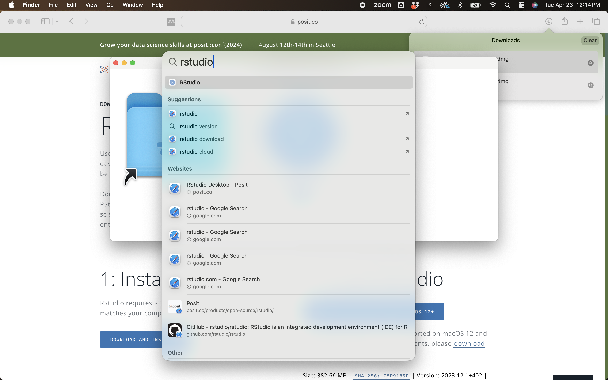
## Installing RStudio (Mac)
You may get a warning that RStudio is an application downloaded from the internet. Go ahead and click "Open".

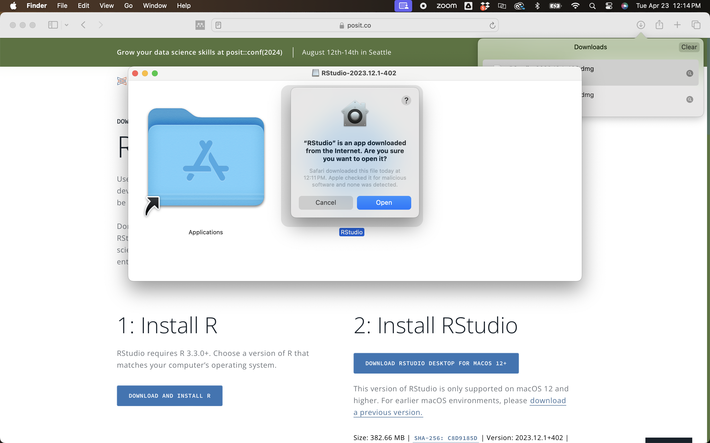

## Installing RStudio (Windows)
For Windows, the process is similar. From the RStudio main pag, click on "Download RStudio Desktop for Windows" below the _2: Install RStudio_ header. 

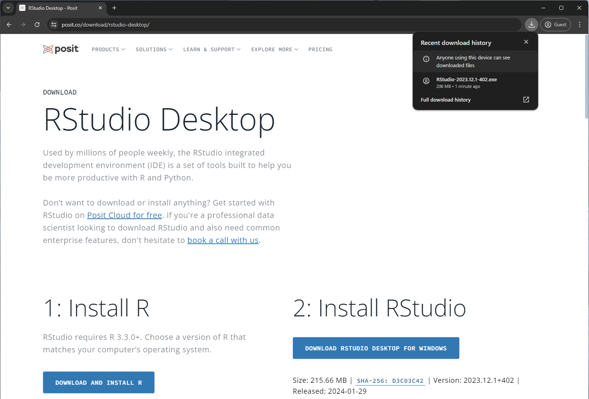


## Installing RStudio (Windows)
You may receive a warning, just click "Yes" to continue the install. 
\center
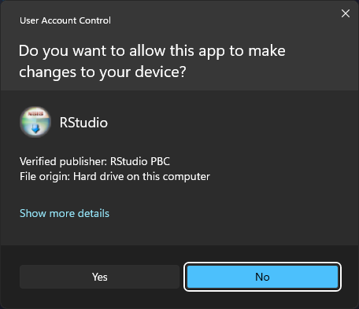{ width=75% }


## Installing RStudio (Windows)
Follow the instructions to install RStudio, defaults are fine.
\center
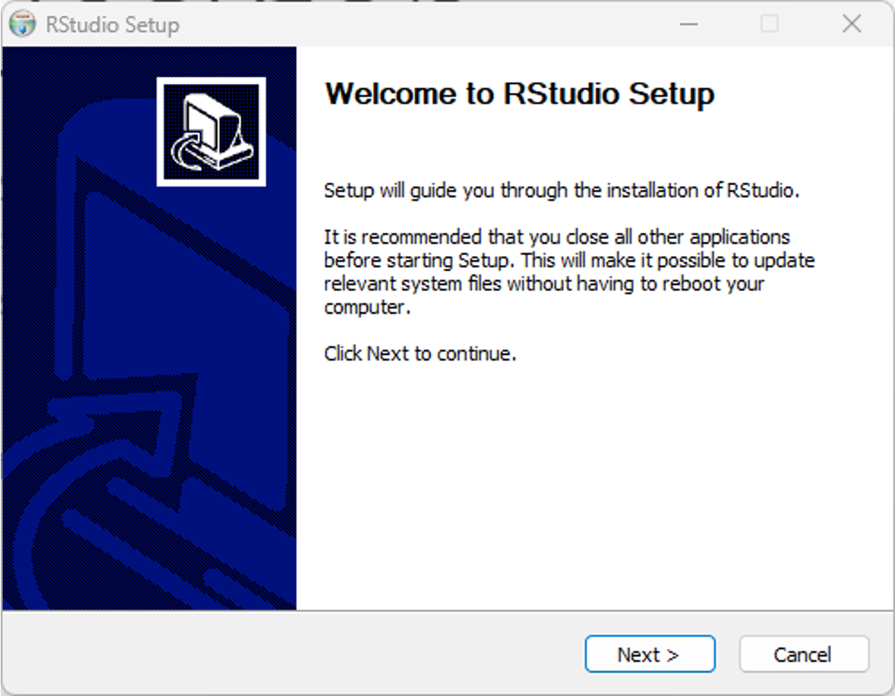{ width=45% }
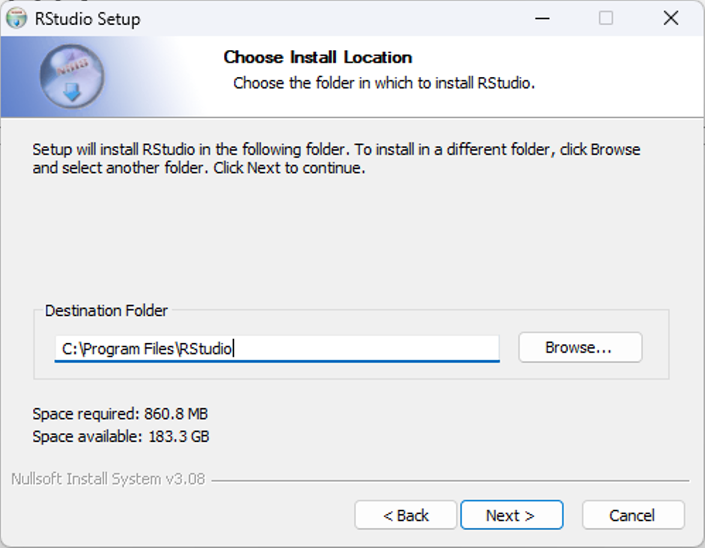{ width=45% }
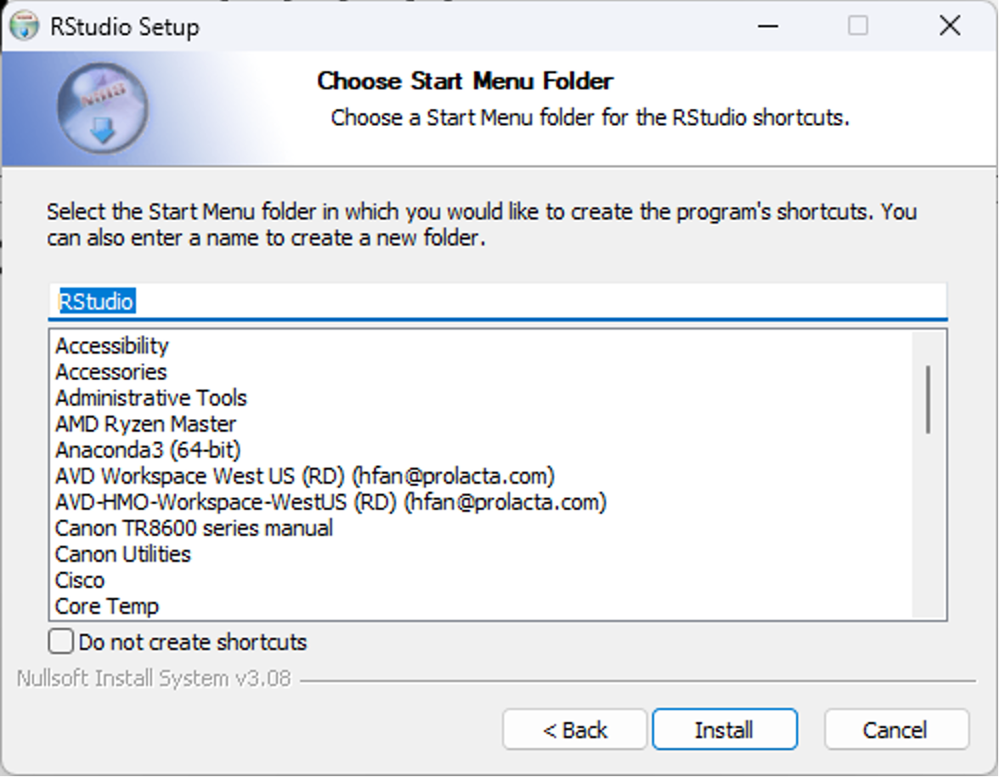{ width=45% }
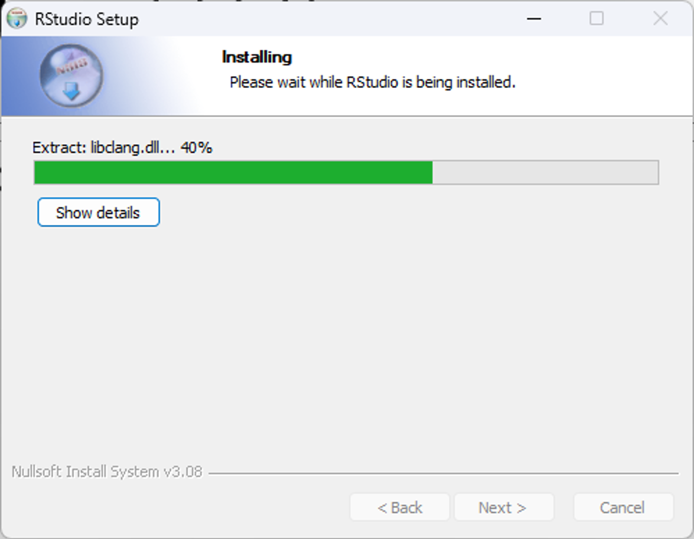{ width=45% }

## Installing RStudio (Windows)
Congratulations! You are done! 
\center
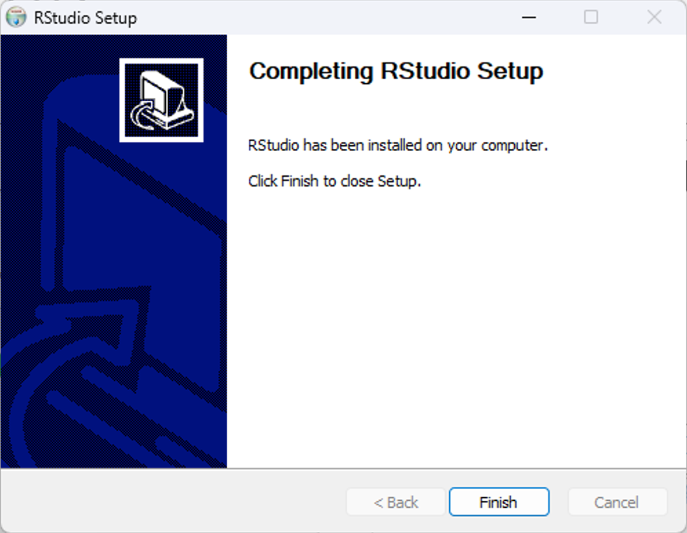{ width=90% }

## Running RStudio (Windows)
On Windows, you can open RStudio from the _Start_ menu. If RStudio does not appear, you can search for it:

```{r, echo=FALSE}
knitr::include_graphics(screenshots[29]) 
```

## Session Info
\scriptsize
```{r session}
sessionInfo()
```
